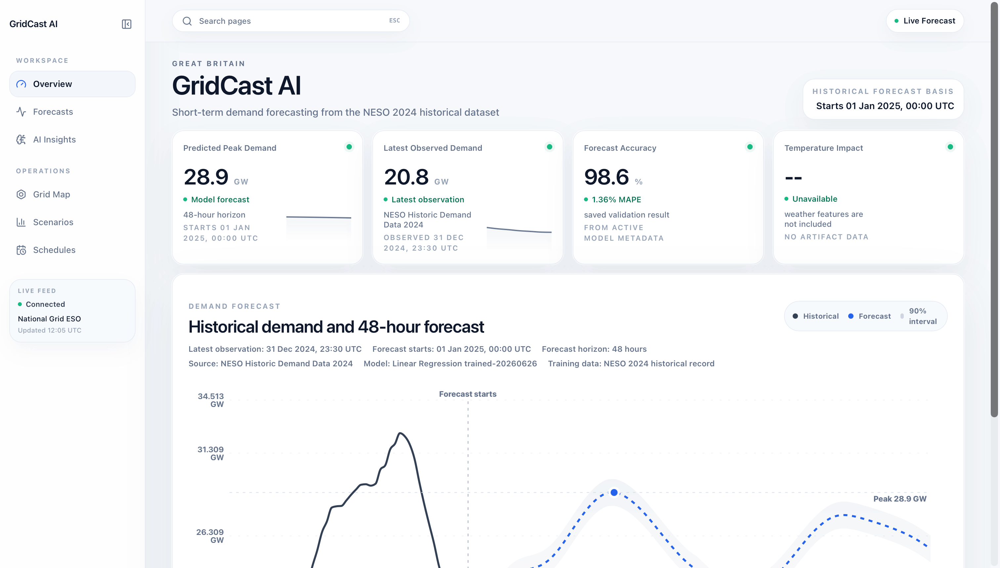
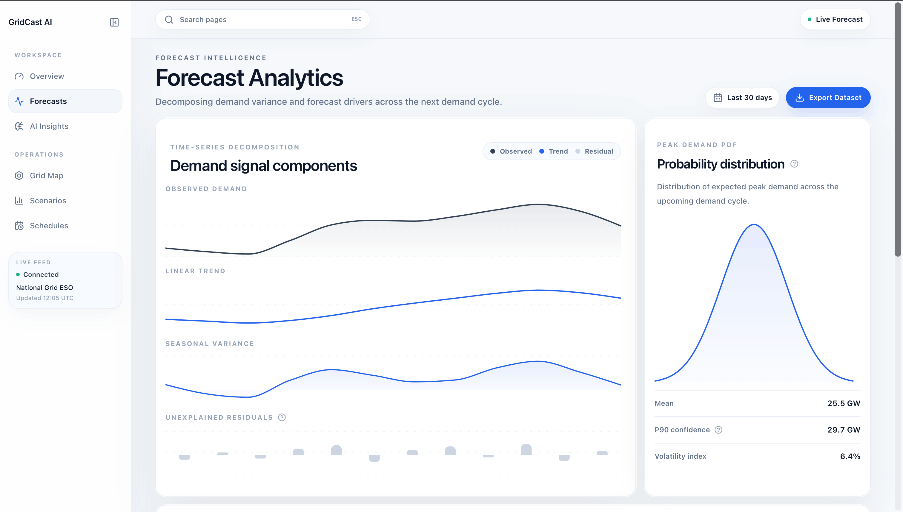
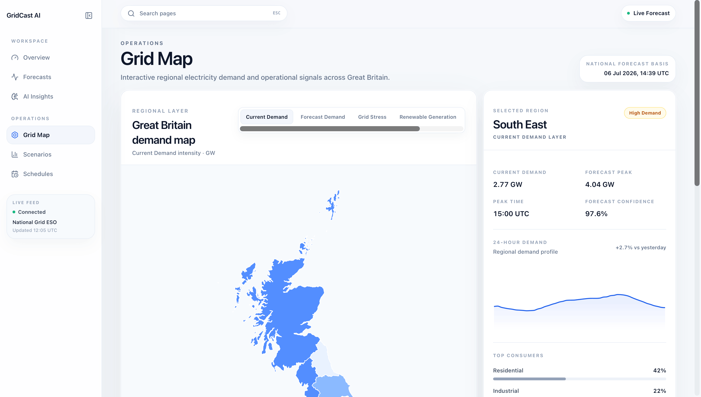
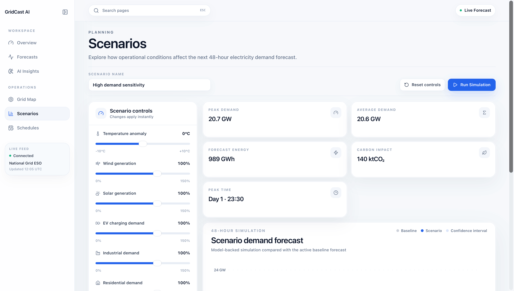
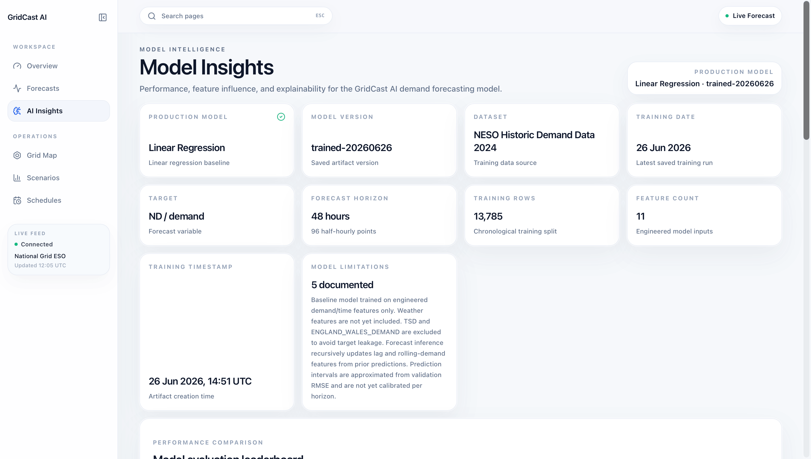

# GridCast AI

> AI-powered electricity demand forecasting for Great Britain using machine learning, explainability, and interactive analytics.

<p align="center">

[]()
[]()
[]()
[]()
[]()
[]()

</p>

---

## Overview

GridCast AI is a full-stack machine learning application that forecasts short-term electricity demand for Great Britain.

The project combines a modern analytics dashboard with a production-style FastAPI backend, a modular machine learning pipeline, model explainability using SHAP, and interactive forecasting tools. It was built to demonstrate practical ML engineering rather than notebook-based experimentation.

The project focuses on the complete lifecycle of an ML product:

- data ingestion
- preprocessing
- feature engineering
- model training
- evaluation
- explainability
- API serving
- interactive frontend visualisation

---

## Current Status

- Public engineering-case-study landing page available at `/`
- Dashboard application available under `/dashboard`, including Overview, Forecast Analytics, Model Insights, Grid Map, Scenarios, and Schedules
- Backend architecture complete
- `/forecast`, `/history`, `/metrics`, and `/model` now read from processed NESO data and saved model artifacts
- Real historical demand ingestion pipeline complete
- Baseline training and first-pass 48-hour inference run from the processed demand dataset
- Weather and calendar data are still mocked placeholders

---

# Dashboard

## Overview



The main dashboard displays live forecasting KPIs, historical demand, 48-hour forecasts and model metadata.

---

## Forecast Analytics



Analyse forecast behaviour through demand decomposition, confidence intervals and probability distributions.

---

## Grid Map



Interactive regional demand visualisation across Great Britain with multiple operational layers including:

- Current Demand
- Forecast Demand
- Grid Stress
- Renewable Generation

---

## Scenario Simulator



Run interactive "what-if" simulations by adjusting demand drivers and immediately generating a new model-backed forecast.

---

## Model Insights



Understand why the model produced a prediction using SHAP explainability, feature importance and local prediction contributions.

---

# Key Features

## Frontend

- Modern Next.js App Router architecture
- Responsive analytics dashboard
- Interactive demand forecasting
- Regional electricity demand map
- Scenario simulator
- Model explainability views
- Forecast analytics
- Searchable application navigation
- Production-style UI using Tailwind CSS and shadcn/ui

## Backend

- FastAPI REST API
- Typed Pydantic schemas
- Modular service architecture
- Model-backed forecasting endpoints
- SHAP explainability endpoints
- Model metadata endpoints
- Historical demand API
- Confidence interval generation
- Scenario simulation engine

## Machine Learning

- Historical NESO demand ingestion
- Data validation pipeline
- Feature engineering
- Time-series forecasting
- Model comparison
- Recursive multi-step forecasting
- SHAP feature importance
- Local prediction explanations
- Artifact loading
- Automatic fallback handling

---

# Tech Stack

## Frontend

- Next.js
- React
- TypeScript
- Tailwind CSS
- shadcn/ui
- Recharts

## Backend

- FastAPI
- Python
- pandas
- NumPy
- scikit-learn
- XGBoost
- SHAP
- Pydantic

---

# Project Structure

```text
gridcast-ai/
├── src/
│   ├── app/
│   ├── components/
│   ├── lib/
│   └── data/
│
├── backend/
│   ├── app/
│   │   ├── api/
│   │   ├── core/
│   │   ├── models/
│   │   ├── schemas/
│   │   ├── services/
│   │   └── main.py
│   │
│   ├── ml/
│   │   ├── ingestion/
│   │   ├── preprocessing/
│   │   ├── features/
│   │   ├── validation/
│   │   ├── training/
│   │   ├── inference/
│   │   ├── evaluation/
│   │   └── explainability/
│   │
│   ├── tests/
│   ├── data/
│   └── models/
│
├── public/
├── README.md
├── PROJECT_CONTEXT.md
└── ROADMAP.md
```

---

# Application Architecture

```
NESO Historic Demand Data
            │
            ▼
     Data Validation
            │
            ▼
   Feature Engineering
            │
            ▼
   Model Training Pipeline
            │
            ▼
     Saved ML Artifacts
            │
            ▼
      FastAPI Backend
            │
            ▼
     REST API Endpoints
            │
            ▼
     Next.js Dashboard
```

---

# Machine Learning Pipeline

GridCast AI follows a modular forecasting pipeline.

1. Load historical electricity demand
2. Validate raw data
3. Clean timestamps
4. Generate calendar features
5. Generate lag features
6. Generate rolling statistics
7. Train baseline models
8. Compare model performance
9. Save trained artifacts
10. Serve forecasts through FastAPI
11. Generate SHAP explanations
12. Display results inside the dashboard

Current baseline models include:

- Linear Regression
- Random Forest
- XGBoost

Evaluation metrics:

- MAE
- RMSE
- MAPE
- R²

---

# Explainability

GridCast AI includes model explainability using SHAP.

Features include:

- Global feature importance
- Local prediction explanations
- Waterfall contribution charts
- Mean absolute SHAP importance
- Cached explainability
- Automatic explainer selection

Supported explainers:

- LinearExplainer
- TreeExplainer
- Permutation fallback

---

# Dataset

Current forecasting uses:

**National Energy System Operator (NESO)**

Historic Demand Data 2024

Features include:

- National Demand
- Transmission System Demand
- England & Wales Demand
- Settlement periods
- Half-hour timestamps

Engineered features include:

- Hour
- Day
- Month
- Day of week
- Weekend flag
- Lag demand
- Rolling averages

---

# API Endpoints

| Endpoint | Description |
|-----------|-------------|
| GET /health | Health check |
| GET /forecast | 48-hour demand forecast |
| POST /simulate | Scenario simulation |
| GET /history | Historical demand |
| GET /metrics | Model metrics |
| GET /feature-importance | SHAP feature importance |
| GET /explain | Local SHAP explanation |
| GET /model | Model metadata |

---

# Running Locally

## Frontend

```bash
npm install

npm run dev
```

By default:

```
http://localhost:3000
```

Optional environment variable:

```env
NEXT_PUBLIC_API_BASE_URL=http://127.0.0.1:8001
```

---

## Backend

```bash
cd backend

python -m venv .venv

source .venv/bin/activate

pip install -r requirements.txt

uvicorn app.main:app --reload --port 8001
```

Backend:

```
http://127.0.0.1:8001
```

---

# Current Capabilities

✅ Full-stack web application

✅ Machine learning forecasting pipeline

✅ Interactive analytics dashboard

✅ Regional electricity demand mapping

✅ Scenario simulation

✅ SHAP explainability

✅ Production-style REST API

✅ Responsive UI

✅ Model metadata

✅ Feature importance

✅ Confidence intervals

✅ Historical demand visualisation

---

# Current Limitations

This project intentionally keeps several areas modular for future expansion.

Current limitations include:

- Weather features are currently mocked
- Holiday and event effects are minimal
- Confidence intervals use RMSE approximation
- Recursive forecasting only
- Additional model experimentation is ongoing

---

# Future Improvements

Potential future work:

- Live NESO API integration
- Live weather ingestion
- Probabilistic forecasting
- Transformer-based forecasting
- LSTM comparison
- Rolling-origin backtesting
- Docker deployment
- CI/CD pipeline
- Authentication
- User workspaces

---

# Portfolio Purpose

GridCast AI was built as an end-to-end machine learning engineering project.

Rather than focusing solely on model accuracy, the project demonstrates the broader engineering required to deliver ML systems as usable software, including data pipelines, model serving, explainability, backend architecture, API design and a polished frontend experience.

The goal is to showcase practical full-stack software engineering and machine learning skills in a production-inspired application.
