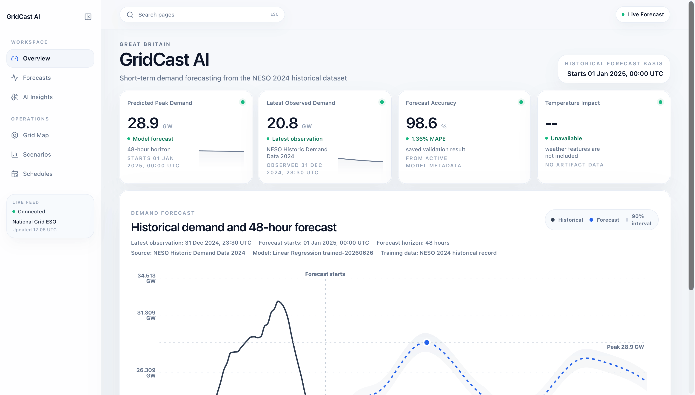
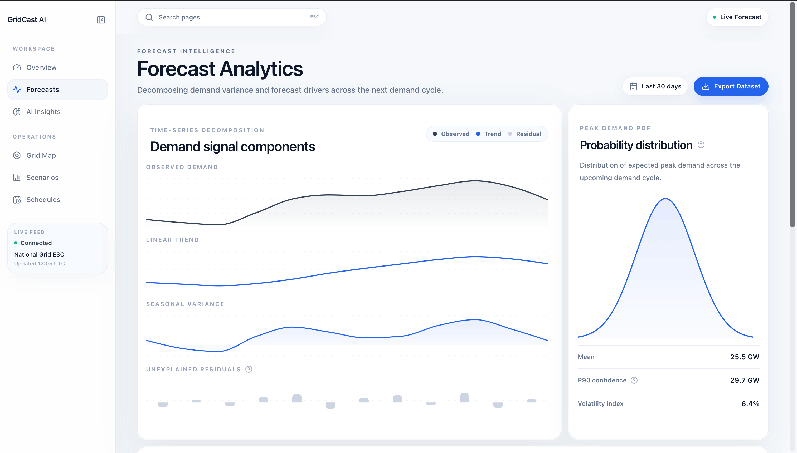
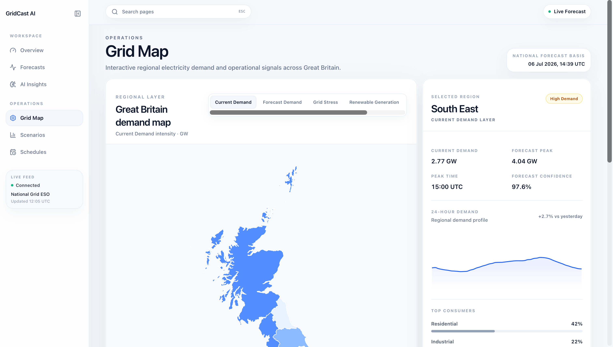
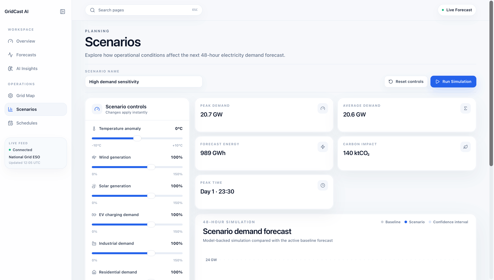
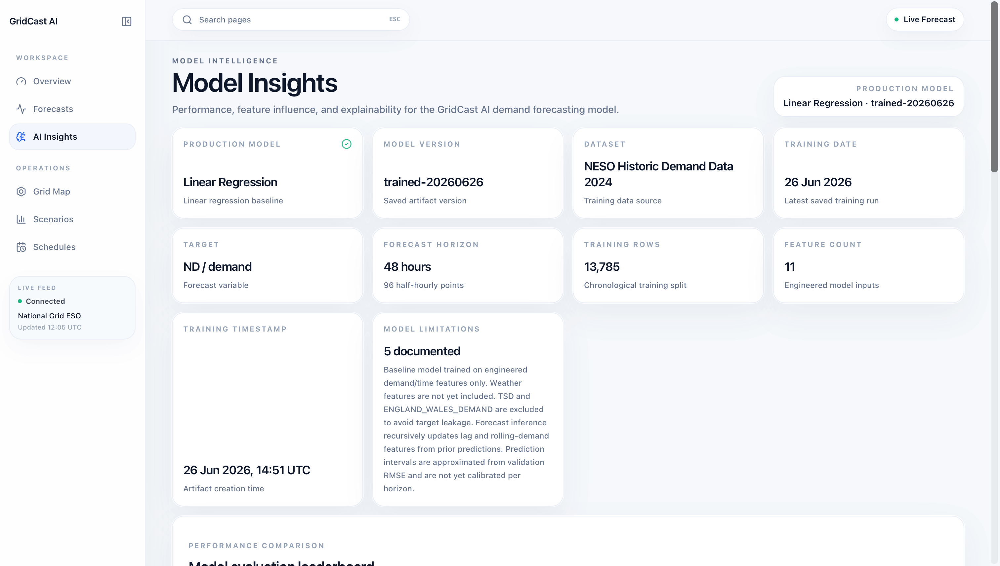

# GridCast AI

> AI-powered electricity demand forecasting for Great Britain using machine learning, explainability, and interactive analytics.

<p align="center">

[]()
[]()
[]()
[]()
[]()

</p>

---

## Overview

GridCast AI is a full-stack machine learning application that forecasts short-term electricity demand for Great Britain.

The project combines a modern analytics dashboard with a production-style FastAPI backend, a modular machine learning pipeline, model explainability using SHAP, and interactive forecasting tools. It was built to demonstrate practical ML engineering rather than notebook-based experimentation.

The project focuses on the complete lifecycle of an ML product:

- data ingestion
- preprocessing
- feature engineering
- model training
- evaluation
- explainability
- API serving
- interactive frontend visualisation

---

## Current Status

- Public engineering-case-study landing page available at `/`
- Dashboard application available under `/dashboard`, including Overview, Forecast Analytics, Model Insights, Grid Map, Scenarios, and Schedules
- Backend architecture complete
- `/forecast`, `/history`, `/metrics`, and `/model` now read from processed NESO data and saved model artifacts
- Real historical demand ingestion pipeline complete
- Baseline training and first-pass 48-hour inference run from the processed demand dataset
- Weather columns exist in the processed dataset but are **not** model features; calendar features are real
- One shared design system across the landing page and the dashboard (see `DESIGN.md`)
- Every screen states its data provenance: artifact, derived, heuristic, illustrative, or unavailable

---

# Dashboard

## Overview



The main dashboard shows the latest observed demand, the model's 48-hour forecast, held-out accuracy and model metadata. Figures come from the saved artifact and the NESO 2024 record — there is no live feed.

---

## Forecast Analytics



Analyse forecast behaviour through demand decomposition, confidence intervals and probability distributions.

---

## Grid Map



Interactive regional demand visualisation across Great Britain with multiple operational layers including:

- Current Demand
- Forecast Demand
- Grid Stress
- Renewable Generation

---

## Scenario Simulator



Run interactive "what-if" simulations by adjusting demand drivers and immediately generating a new model-backed forecast.

---

## Model Insights



Understand why the model produced a prediction using SHAP explainability, feature importance and local prediction contributions.

---

# Key Features

## Frontend

- Modern Next.js App Router architecture
- Responsive analytics dashboard
- Interactive demand forecasting
- Regional electricity demand map
- Scenario simulator
- Model explainability views
- Forecast analytics
- Searchable application navigation
- Production-style UI using Tailwind CSS and shadcn/ui

## Backend

- FastAPI REST API
- Typed Pydantic schemas
- Modular service architecture
- Model-backed forecasting endpoints
- SHAP explainability endpoints
- Model metadata endpoints
- Historical demand API
- Confidence interval generation
- Scenario simulation engine

## Machine Learning

- Historical NESO demand ingestion
- Data validation pipeline
- Feature engineering
- Time-series forecasting
- Model comparison
- Recursive multi-step forecasting
- SHAP feature importance
- Local prediction explanations
- Artifact loading
- Automatic fallback handling

---

# Tech Stack

## Frontend

- Next.js
- React
- TypeScript
- Tailwind CSS
- shadcn/ui
- Recharts

## Backend

- FastAPI
- Python
- pandas
- NumPy
- scikit-learn
- SHAP
- Pydantic

---

# Project Structure

```text
gridcast-ai/
├── src/
│   ├── app/
│   ├── components/
│   ├── lib/
│   └── data/
│
├── backend/
│   ├── app/
│   │   ├── api/
│   │   ├── core/
│   │   ├── models/
│   │   ├── schemas/
│   │   ├── services/
│   │   └── main.py
│   │
│   ├── ml/
│   │   ├── ingestion/
│   │   ├── preprocessing/
│   │   ├── features/
│   │   ├── validation/
│   │   ├── training/
│   │   ├── inference/
│   │   ├── evaluation/
│   │   └── explainability/
│   │
│   ├── tests/
│   ├── data/
│   └── models/
│
├── public/
├── README.md
├── PROJECT_CONTEXT.md
└── ROADMAP.md
```

---

# Application Architecture

```
NESO Historic Demand Data
            │
            ▼
     Data Validation
            │
            ▼
   Feature Engineering
            │
            ▼
   Model Training Pipeline
            │
            ▼
     Saved ML Artifacts
            │
            ▼
      FastAPI Backend
            │
            ▼
     REST API Endpoints
            │
            ▼
     Next.js Dashboard
```

---

# Machine Learning Pipeline

GridCast AI follows a modular forecasting pipeline.

1. Load historical electricity demand
2. Validate raw data
3. Clean timestamps
4. Generate calendar features
5. Generate lag features
6. Generate rolling statistics
7. Train baseline models
8. Compare model performance
9. Save trained artifacts
10. Serve forecasts through FastAPI
11. Generate SHAP explanations
12. Display results inside the dashboard

Trained and evaluated baselines (both present in the saved metadata):

- Linear Regression — the active saved artifact
- Random Forest Regressor

XGBoost is supported by the training code but is not installed or trained in
this deployment, so it does not appear on the leaderboard.

Evaluation metrics:

- MAE
- RMSE
- MAPE
- R²

---

# Explainability

GridCast AI includes model explainability using SHAP.

Features include:

- Global feature importance
- Local prediction explanations
- Waterfall contribution charts
- Mean absolute SHAP importance
- Cached explainability
- Automatic explainer selection

Supported explainers:

- LinearExplainer
- TreeExplainer
- Permutation fallback

---

# Dataset

Current forecasting uses:

**National Energy System Operator (NESO)**

Historic Demand Data 2024

Features include:

- National Demand
- Transmission System Demand
- England & Wales Demand
- Settlement periods
- Half-hour timestamps

Engineered features include:

- Hour
- Day
- Month
- Day of week
- Weekend flag
- Lag demand
- Rolling averages

---

# API Endpoints

| Endpoint | Description |
|-----------|-------------|
| GET /health | Health check |
| GET /forecast | 48-hour demand forecast |
| POST /simulate | Scenario simulation |
| GET /history | Historical demand |
| GET /metrics | Model metrics |
| GET /feature-importance | SHAP feature importance |
| GET /explain | Local SHAP explanation |
| GET /model | Model metadata |

---

# Running Locally

Two processes: a FastAPI backend on **8001** and a Next.js frontend on **3000**.
Start the backend first — the dashboard renders "Backend unavailable" without it.

## 1. Backend

```bash
cd backend
python -m venv .venv
source .venv/bin/activate          # Windows: .venv\Scripts\activate
pip install -r requirements.txt    # add -r requirements-dev.txt to run the tests
uvicorn app.main:app --reload --port 8001
```

Serves on `http://127.0.0.1:8001`. Check it with:

```bash
curl http://127.0.0.1:8001/health
# {"status":"operational","service":"gridcast-api","version":"0.1.0"}
```

Python 3.12 is pinned for deployment in `backend/.python-version`; 3.13 also works locally.

## 2. Frontend

```bash
npm install
npm run dev
```

Serves on `http://localhost:3000`.

## Ports and CORS

The backend only accepts browser requests from origins in its allow-list.
The default is `http://localhost:3000` and `http://localhost:3001`.

**Running the frontend on any other port breaks the scenario simulator**, whose
requests are made from the browser. Server-rendered pages still work, so the
failure looks like sliders that do nothing. Either use port 3000, or widen the
allow-list:

```bash
GRIDCAST_CORS_ORIGINS="http://localhost:3000,http://localhost:5173" \
  uvicorn app.main:app --port 8001
```

## Environment variables

All backend settings use the `GRIDCAST_` prefix and can also live in `backend/.env`
(git-ignored; do not commit secrets).

| Variable | Side | Default | Purpose |
|---|---|---|---|
| `NEXT_PUBLIC_API_BASE_URL` | frontend | `http://127.0.0.1:8001` in dev | Backend base URL. **Required for `npm run build`** — production builds fail fast without it. |
| `GRIDCAST_CORS_ORIGINS` | backend | `localhost:3000,localhost:3001` | Comma-separated browser origins allowed to call the API. |
| `GRIDCAST_ENVIRONMENT` | backend | `local` | `local` / `development` / `staging` / `production`. |
| `GRIDCAST_MODEL_ARTIFACT_PATH` | backend | `backend/models/model.pkl` | Override for testing the fallback state. |
| `GRIDCAST_MODEL_METADATA_PATH` | backend | `backend/models/model_metadata.json` | As above. |
| `GRIDCAST_TRAINING_DATASET_PATH` | backend | `backend/data/processed/training_dataset.csv` | As above. |

Production build:

```bash
NEXT_PUBLIC_API_BASE_URL=http://127.0.0.1:8001 npm run build && npm start
```

## Checks

```bash
npx tsc --noEmit          # types
npm run lint              # eslint
npm run build             # production build (needs NEXT_PUBLIC_API_BASE_URL)
cd backend && python -m pytest -q   # 32 backend tests
```

## Data-source states

The shell always reports where its numbers come from, and never claims a live feed:

| State | Condition | Chrome reads |
|---|---|---|
| Artifact | backend up, `model.pkl` + metadata load | `Artifact data` (green) |
| Artifacts unavailable | backend up, artifacts missing | `Artifacts unavailable` (neutral); values omitted |
| Backend unavailable | API not reachable | `Backend unavailable` (red); values show `Unavailable` |

To exercise the middle state without touching the real artifacts:

```bash
GRIDCAST_MODEL_ARTIFACT_PATH=/tmp/missing.pkl \
GRIDCAST_MODEL_METADATA_PATH=/tmp/missing.json \
GRIDCAST_TRAINING_DATASET_PATH=/tmp/missing.csv \
  uvicorn app.main:app --port 8001
```

## Explainability

`shap` is a declared backend dependency and powers `GET /explain` and SHAP-based
`GET /feature-importance`. It pulls `numba` and `llvmlite` (~157 MB installed).
If it is absent the API degrades rather than failing: `/explain` returns 503 and
feature importance falls back to the estimator's native coefficients. The two
SHAP-specific tests skip in that case.

---

# Current Capabilities

✅ Full-stack web application

✅ Machine learning forecasting pipeline

✅ Interactive analytics dashboard

✅ Regional electricity demand mapping

✅ Scenario simulation

✅ SHAP explainability

✅ Production-style REST API

✅ Responsive UI

✅ Model metadata

✅ Feature importance

✅ Confidence intervals

✅ Historical demand visualisation

---

# Current Limitations

This project intentionally keeps several areas modular for future expansion.

Current limitations include:

- Weather features are not model inputs (the columns are present but unused)
- Holiday and event effects are minimal
- Confidence intervals use an RMSE approximation, uniform across the horizon
- Recursive forecasting only: reported 1.36% MAPE is **one step ahead**, not measured for the 48-hour horizon
- Regional map layers are derived, heuristic or illustrative — the model is national
- Additional model experimentation is ongoing

---

# Future Improvements

Potential future work:

- Live NESO API integration
- Live weather ingestion
- Probabilistic forecasting
- Transformer-based forecasting
- LSTM comparison
- Rolling-origin backtesting
- Docker deployment
- CI/CD pipeline
- Authentication
- User workspaces

---

# Deployment

Vercel deploys the frontend and Render deploys the backend, both from `main`.
**Pushing `main` always deploys the frontend**, whether or not Render's
Auto-Deploy is on. Sequence, required environment variables and post-release
checks: [DEPLOYMENT.md](DEPLOYMENT.md).

---

# Rolling back a release

`main` is deployed from, so roll back by adding a commit, never by rewriting
history. Revert the redesign merge with `git revert -m 1 <merge-sha>`, or restore
individual files from the `backup/pre-redesign-main` tag. Full procedure in
[DESIGN.md](DESIGN.md#rolling-back-after-release).

---

# Portfolio Purpose

GridCast AI was built as an end-to-end machine learning engineering project.

Rather than focusing solely on model accuracy, the project demonstrates the broader engineering required to deliver ML systems as usable software, including data pipelines, model serving, explainability, backend architecture, API design and a polished frontend experience.

The goal is to showcase practical full-stack software engineering and machine learning skills in a production-inspired application.
